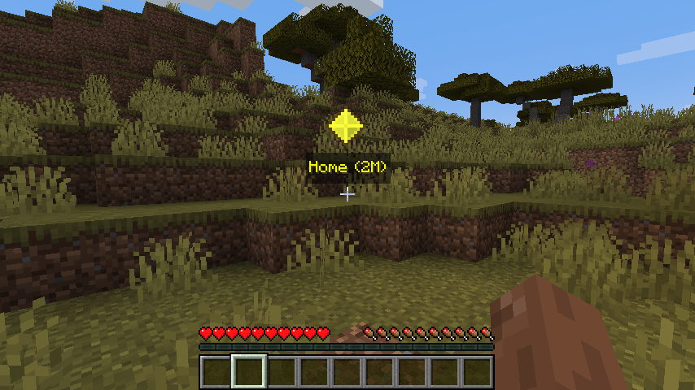
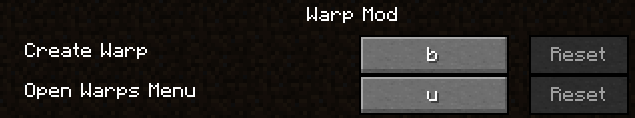
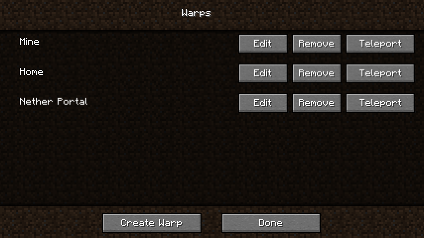
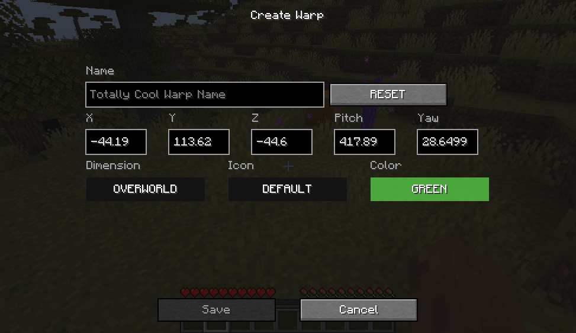

# Description

It allows teleporting to various warps, This mod does NOT need to be installed client-side.

# Clientside

This mod can now be installed purely serverside, purely clientside, or for the best experience installed on both.
# Waypoints
Warps can now show in game via waypoints.

## Keybindings

| Key | Name            | Description                      | 
|-----|-----------------|----------------------------------|
| B   | Create Warp     | This will open a quick create UI |
| U   | Open Warps Menu | This will open a warp list UI    |

## Warp Menu
This is a menu to show a list of all of your warps, remove, edit and teleport to them.

## Edit/Create Warp Screen
This is the menu that will allow you to create and edit your warps

# Serverside

## Commands

- `/warp set <name>` - *creates a warp*
- `/warp list` - *lists all warps created*
- `/warp back` - *when you teleport using warp a "warp back" is automatically created.*
- `/warp random [<max>] [<min>]` - *randomly teleports the player using the max and min. by default max is **500** and
  min is **25** blocks away.*
- `/warp rename <old> <new> [<overwrite>]` - *renames the **old** warp name to **new**  warp name, if new warp exists
  overwrite will overwrite it.*
- `/warp <name>` - *Teleports you to that warp point.*
- `/warp spawn` - *Teleports you to spawn*
- `/warp remove <name>` - *removes warp*

# FAQ:

1. Can I use this in a modpack
    - Yes, you are more than welcome to add this to your modpack.
1. If I have an error where is the best place to vocalize.
    - Posting in the Issues section would be the easiest way for me to notice, but I do read and reply to all comments.

# Video

